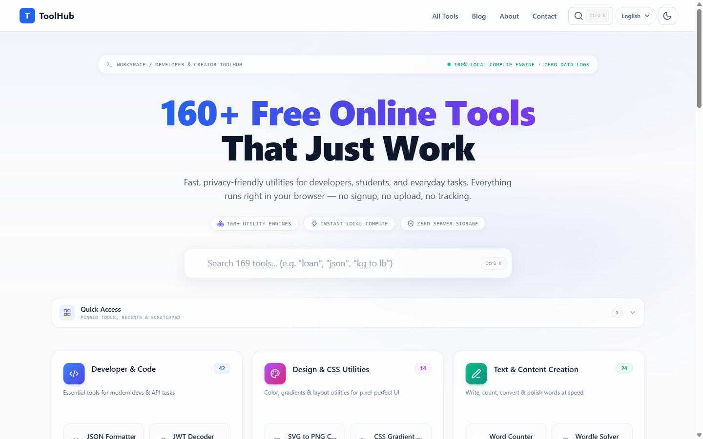
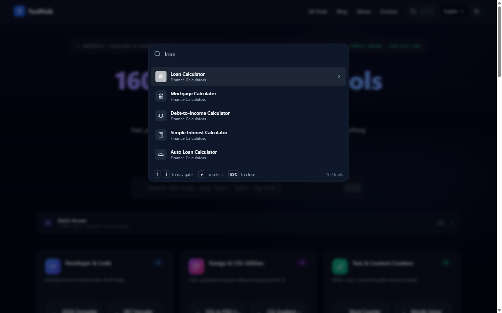
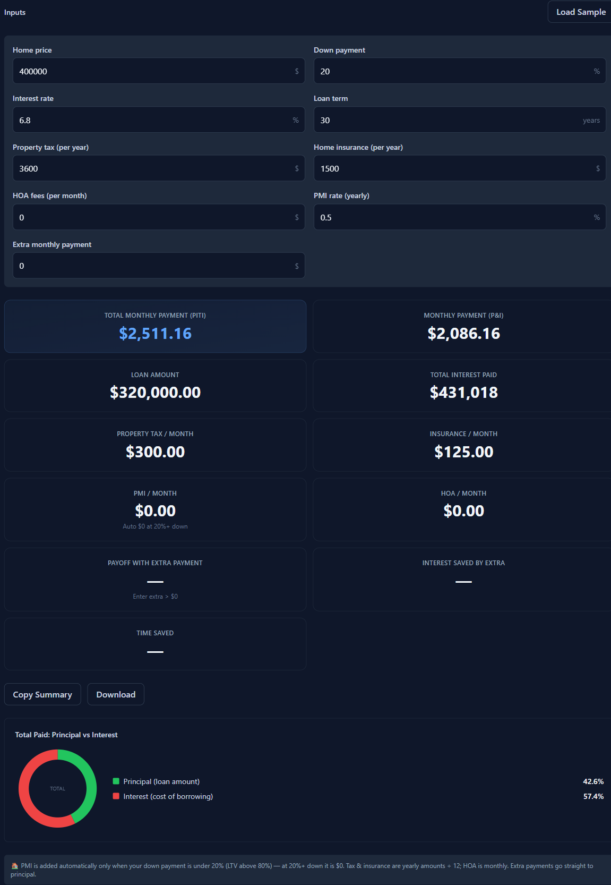

<div align="center">

# 🧰 ToolHub

### **225 free online tools — calculators, converters & developer utilities that run 100% in your browser.**

No sign-up · No uploads · Nothing you type ever leaves your device

[](https://nextjs.org)
[](https://www.typescriptlang.org)
[](https://tailwindcss.com)
[](https://pages.cloudflare.com)
[](https://developer.mozilla.org/en-US/docs/Web/Progressive_web_apps)


[🌐 **Live Site**](https://toolhub.axtrivc.com) &nbsp;·&nbsp; [🧭 **Browse All Tools**](https://toolhub.axtrivc.com/tools)

<br/>

<picture>
  <source media="(prefers-color-scheme: dark)" srcset="docs/assets/hero-dark.png">
  
</picture>

</div>

---

## ✨ Why ToolHub?

> Every tool is a single static page — fast to load, free to use, and **all computation happens locally in your browser**. No accounts, no server-side processing, no data collection of what you type.

| | |
|:---|:---|
| 🔒 **Privacy-first** | Inputs never leave your device — calculations run client-side, period |
| 🌍 **Four languages** | English, 中文, Español, Deutsch — switchable from any page |
| ⌨️ **Command palette** | Press <kbd>Ctrl</kbd>/<kbd>Cmd</kbd> + <kbd>K</kbd> to fuzzy-search all 225 tools |
| 📱 **Installable PWA** | Service-worker caching keeps repeat visits fast, even offline |
| 🌗 **Dark & light themes** | Plus keyboard-friendly dialogs, skip links & reduced-motion support |
| 🍪 **Consent-gated extras** | Ads and GA4 load only after opt-in; built-in analytics are cookie-free |

---

## 🎬 See It In Action

<table>
<tr>
<td width="50%" valign="top">

**⌨️ Command palette** — fuzzy-search all 225 tools from anywhere

<br/>



</td>
<td width="50%" valign="top">

**🧮 Live calculators** — results & charts update as you type

<br/>



</td>
</tr>
</table>

---

## 🗂️ 225 Tools · 15 Categories

| | | |
|:---|:---|:---|
| 🧑‍💻 **Developer Tools** — 50 | 💰 **Finance Calculators** — 39 | 📝 **Text Tools** — 29 |
| 🔄 **Unit Converters** — 19 | 🧮 **Math Calculators** — 19 | 🎨 **Web Design Tools** — 14 |
| 🩺 **Health Calculators** — 15 | 🔐 **Security Tools** — 9 | ⏰ **Time Calculators** — 8 |
| 🤖 **AI Tools** — 11 | 🎲 **Game Tools** — 4 | 🎓 **Education Calculators** — 3 |
| 💼 **Business Tools** — 3 | 🐶 **Pet Tools** — 1 | 🏠 **Home Calculators** — 1 |

👉 [Explore the full directory](https://toolhub.axtrivc.com/tools)

---

## 🛠️ Tech Stack

| Layer | Choice |
|:---|:---|
| **Framework** | Next.js 16 (App Router) + TypeScript, statically exported |
| **Styling** | Tailwind CSS + semantic design tokens (light / dark) |
| **Animation** | Framer Motion — column-staggered entrances, reduced-motion fallbacks |
| **Hosting** | Cloudflare Pages (pure static output) |
| **Visitor stats** | Cloudflare Pages Functions + D1 (cookie-free, daily-rotating visitor hash) |
| **PWA** | Service Worker — network-first HTML, stale-while-revalidate assets |
| **SEO** | Auto-generated `sitemap.xml` / `robots.txt`, JSON-LD structured data |

---

## 🚀 Get Started

```bash
# 1️⃣ Install dependencies
npm install

# 2️⃣ Start the dev server → http://localhost:3000
npm run dev

# 3️⃣ Production build → pure static files in out/
npm run build
```

The `out/` directory is plain HTML/CSS/JS — deployable to any static host.

---

## 🔧 Environment Variables

| Variable | What it does |
|:---|:---|
| `NEXT_PUBLIC_SITE_URL` | Canonical URL for sitemap / canonical tags / Open Graph |
| `NEXT_PUBLIC_ADSENSE_CLIENT` | AdSense publisher ID — ad slots render only when set |
| `NEXT_PUBLIC_CF_ANALYTICS_TOKEN` | Cloudflare Web Analytics beacon token |
| `NEXT_PUBLIC_GA_ID` | GA4 measurement ID — loaded only after cookie consent |

> [!NOTE]
> `NEXT_PUBLIC_*` values are inlined at **build time** — rebuild after changing them.

---

## ➕ Adding a Tool

1. 📁 Create `app/tools/<slug>/page.tsx` — [`app/tools/slug-generator/`](app/tools/slug-generator) works as a template
2. 🗃️ Register it in [`lib/tools.ts`](lib/tools.ts) with `published: true`
3. 🪄 Done — the homepage, footer, sitemap and search palette pick it up automatically

---

## 📁 Project Structure

```
app/           # App Router pages
  tools/       #   225 tool pages (one <slug>/page.tsx each)
  blog/        #   technical write-ups
  about/ contact/ privacy/ terms/   # compliance pages
  sitemap.ts   #   auto-generated sitemap.xml
  robots.ts    #   auto-generated robots.txt
components/    # Shared UI — Header, Footer, SearchPalette, AdSlot, calculator fields
lib/           # Tool registry & metadata, i18n dictionaries, SEO / JSON-LD helpers
functions/     # Cloudflare Pages Functions (visitor-stats API backed by D1)
public/        # Static assets + service worker
docs/assets/   # README screenshots
```

---

<div align="center">

**🧰 ToolHub** — built with Next.js, hosted on Cloudflare Pages

[🌐 toolhub.axtrivc.com](https://toolhub.axtrivc.com)

</div>
